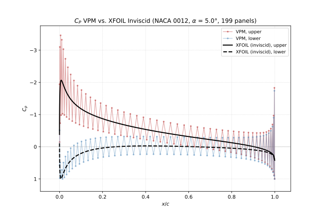

# Airfoil Vortex Panel Method (VPM) Analysis Tool

A Python pipeline comparing three methods of 2D airfoil analysis with increasing physical fidelity: analytical thin airfoil theory, a from-scratch constant-strength vortex panel method, and XFOIL. 



*Pressure Coefficient of from-scratch VPM vs. XFOIL Inviscid results. NACA 0012 @ 5 degrees angle of attack, discretized to 199 panels.*

---

## Overview

Airfoil analysis spans a range of fidelity, from closed-form analytical results to viscous-coupled numerical solvers, with each level trading physical completeness against computational cost and interpretability. This tool implements three points along that range and compares them directly on the same geometry: thin airfoil theory, which collapses an airfoil into its mean camber line (zero thickness); a constant-strength vortex panel method solved on the actual airfoil surface but still inviscid; and XFOIL, whose viscous mode couples a panel solution to an integral boundary layer model.

XFOIL inviscid was used as a verification tool to ensure the accuracy of the from-scratch vortex panel method, while its viscous solver results demonstrate how at higher angles of attack ($\alpha$) the lift results differ due to real world boundary layer separation. This is where the inviscid assumption breaks down: the panel methods remain fast and numerically well-behaved, but their results become physically inaccurate as $\alpha$ increases.

---

## Features

- Generate NACA 4-digit geometry with half-cosine spacing
- Solve thin airfoil theory analytically via Fourier coefficients
- Solve a constant-strength VPM with a Neumann boundary condition (zero outwards normal panel velocity)
- Interface with XFOIL in inviscid and viscous mode; called automatically via master script.
- Export coefficients and pressure distributions across $\alpha$ to CSV.

---

## Key Results

- $C_L$ agrees with XFOIL inviscid lift to within 0.04 across $\alpha \in [−5°, 20°]$  
- The two independent lift derivations (Kutta-Joukowski and pressure integration) agree to within 0.01 across $\alpha$ sweep despite panel-level oscillation in the pressure distribution, since the oscillatory behaviour cancels under integration.
- $cond(K)$ grows as approximately $O(N^2)$; 6.96e+03 at 199 panels indicating growing sensitivity to perturbation under refinement.
- Symmetric-airfoil degenerate cases return zero net circulation and zero pressure difference across upper and lower surfaces

---

## Verification

The solver is checked against analytical results, internal consistency, and an independent code. No experimental data is used, so all checks below are verification rather than validation.

- **Degenerate case:** A symmetric NACA 00XX airfoil at $\alpha = 0°$ must produce zero circulation by symmetry, independent of panel count. The solver returns $C_L$ on the order of 1e-13 and $C_{M,c/4}$ on the order of 1e-14, confirming the geometry, algorithm, and matrices with the Kutta condition are consistent.

- **Independent lift derivations:** C_L is computed two ways from the same solved vortex strengths: Kutta-Joukowski circulation, and integration of the surface pressure distribution. These are independent derivations through separate algorithms, so agreement between them validates the overall pressure results. The two agree to within 0.01 across the sweep.

- **XFOIL comparison:** XFOIL inviscid is run on the same coordinate file as an independent reference. Maximum $|ΔC_L|$ is 0.04 at 20 degrees, roughly 1.7% of $C_L$ at that angle, and the residual grows linearly from zero rather than showing any structural disagreement.

---

## Requirements

**Python packages**

```bash
pip install -r requirements.txt
```

**XFOIL**

XFOIL is not bundled with this repository (GPL licensed, platform specific).
Download it from [MIT's XFOIL page](http://web.mit.edu/drela/Public/web/xfoil/) and either place the executable on your system PATH or set the `XFOIL_PATH` environment variable to point at it.

The thin airfoil theory and vortex panel method solvers run without XFOIL. Only the comparison and pressure-overlay stages require it, so the tool is usable for its own solvers alone if XFOIL is unavailable.

---

## Usage

**1. Generate airfoil coordinates**

```bash
python naca4_coord_gen.py
```

Prompts user via terminal to type in their desired 4 digit NACA airfoil code, the desired mesh density via chordwise point count, and then a confirmation of their NACA airfoil and mesh density inputs. Once generated, user is asked if they want to save .dat file in saved_airfoil_coords/.

**2. Run the analysis**

```bash
python airfoil_aerodynamic_analysis.py
```
Prompts user via terminal to define and confirm angle of attack range which all solvers will run on, namely lower bound, upper bound, and step size in DEGREES. Solver methods are called automatically, $C_L$, $C_{M,LE}$, $C_{M,c/4}$, and $C_P$ plots are generated via matplotlib and distributions are written to computation_results/ folder in .csv format. Edit the filenames array in the __main__ block.

---

## Repository Structure

```
naca-airfoil-analysis/
├── airfoil_aerodynamic_analysis.py   [master script]
├── naca4_coord_gen.py                [naca 4 digit generator]
├── constant_vpm.py                   [from-scratch vortex panel method]
├── thin_airfoil_theory.py            [airfoil analytic solution]
├── xfoil_wrapper.py                  [XFOIL subprocess routine]
├── panel_geometry.py                 [geometric parameters and matrices]
├── post_processing.py                [exporting and plotting]
├── saved_airfoil_coords/             [saved airfoil .dat coordinates]
├── computation_results/              [saved coefficient .csv data]
└── figures/                          [figures used in report]
```

---

## Documentation

- [`DECISIONS.md`](DECISIONS.md) — [one line]
- [Report PDF](path) — [one line]

---

## Limitations

- Inviscid and incompressible assumptions made for thin airfoil theory and the constant-strength VPM
- Only single-element airfoils valid. Multi-element airfoils not covered in scope
- No drag prediction from constant-strength VPM, matching D'Alembert's paradox 
- Limited currently to only 4 digit airfoils via in-repo generator script

---

## References

[Katz & Plotkin]
[Anderson]
[Abbott & von Doenhoff]
[Drela & Giles]

---

## License

This project is licensed under the MIT License; see the [LICENSE](LICENSE) file for details.
